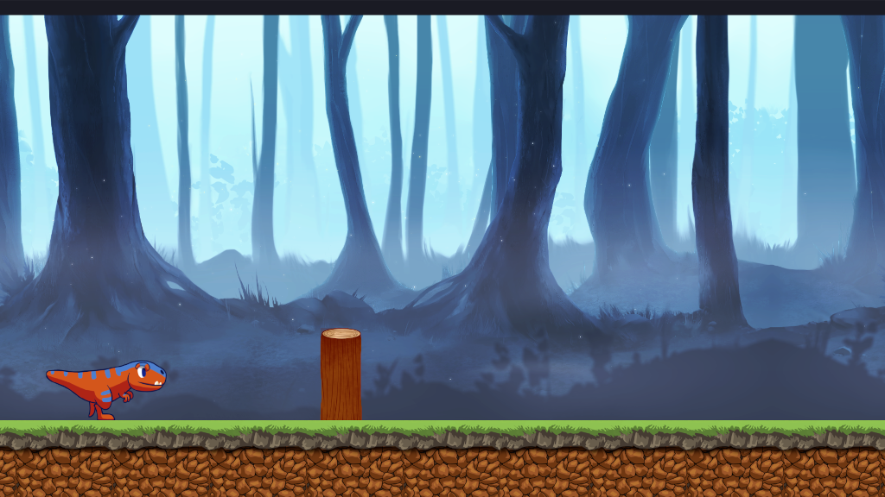

# Dino Platformer
> Simple 2D platform game.

The classic Chrome Dinosaur Game done with SDL.

### :package: Download and Compile

Requirements:

- C++ 17 or higher.
- SDL2 with Image and Mixer libraries.
- CMake v3.16 or higher

### :raised_hands: Resource Attributions

**Texture images**

[PNG Item](https://www.pngitem.com/middle/TxTwxwJ_dino-sprite-sheet-png-download-transparent-png/)

[Two PNG from pngtree.com](https://pngtree.com/so/Two)

**Audio files**

[8 Bit Power! by HeatleyBros](https://www.youtube.com/watch?v=UJ9NbyPFTvY)

[Mixkit Free Game Sound Efects](https://mixkit.co/free-sound-effects/game)

[Sound Effect from Pixabay](https://pixabay.com/sound-effects/?utm_source=link-attribution&amp;utm_medium=referral&amp;utm_campaign=music&amp;utm_content=6462)
